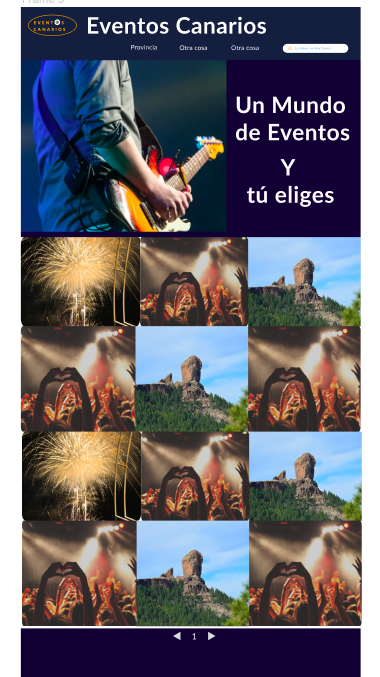
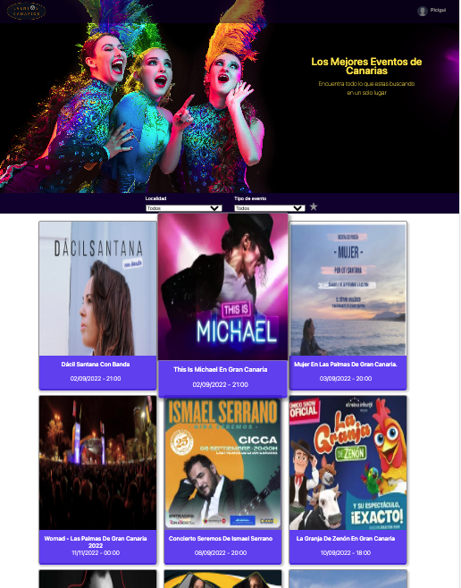
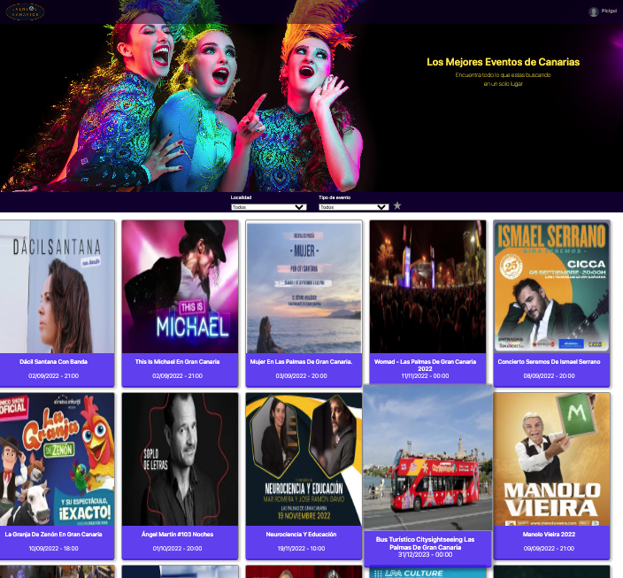
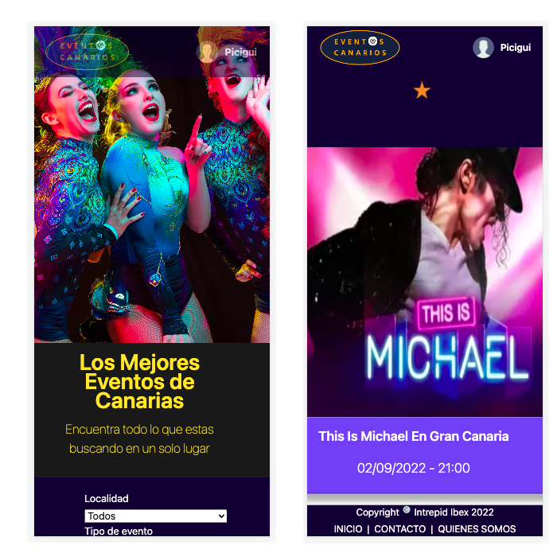
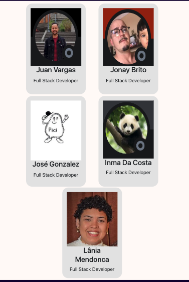

# Proyecto para final del curso FullStack de la SPEGC. ---> 

# EventosFullStack:

Es el nombre del proyecto y surgió de una de las propuestas mas votadas en el grupo de las CABRAS formados por los 5 integrantes iniciales.

La idea inicial era "la creación de una pagina que publicara todos los eventos proximos a realizar en Gran Canaria", de ese modo todo el que buscara algo que hacer podría abrir la pagina y ver las propuestas a elegir.

Una vez desarrollando el proyectos decidimos que era necesario permitir que los usuarios registrados pudieran introducir los eventos una vez verificados por los gestores de la web.

Y aun nos quedan un par de ideas para ir incrementando la base de datos y eventos disponible, así como utilidades a añadir a los usuarios.

## Metodologia

El programa esta basado y elaborado en Angular, para obtener la flexibilidad necesaria y ser lo más responsiva y versátil posible para adaptarse a los datos e imágenes que pueda aportar el cliente.

## Bocetos de inicio del proyeco

Esta era la idea inicial.

## Actualmente este es el aspecto del proyeco

## Responsive y Moviles:

Este apartado se ha consiguido en gran parte a un 90%, aunque todavia se encuentra en fase de prueba y seguro que se puede mejorar

## Dificultades:

La mayor dificultad del programa fué el ir incrementando los procesos de coneccion a la Api a medida que ibamos aprendiendo en el curso, pero nos ha servido de gran aprendizaje, así como el trabajar en equipo, ya que para alguno era una experiencia nueva.

Pero sin embargo puedo decir que !!!!! Reto superado !!!!!

## Acceso al proyecto:

https://github.com/picigui/ProyectoJLGS02
https://moonlit-travesseiro-3513cc.netlify.app/

This project was generated with [Angular CLI](https://github.com/angular/angular-cli) version 14.0.4.

## Acceso al equipo de desarrollo:

Con sus respectivos link de contacto:

# José Luis González Sánchez

https://github.com/picigui

https://www.linkedin.com/in/pici-gui-78b57293

# Juan Carlos Vargas Chávez

https://github.com/jvarc

https://www.linkedin.com/in/juan-carlos-vargas-chavez-407705128/
