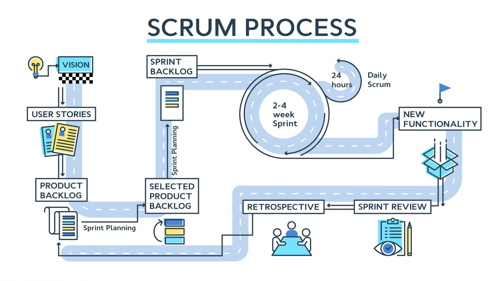
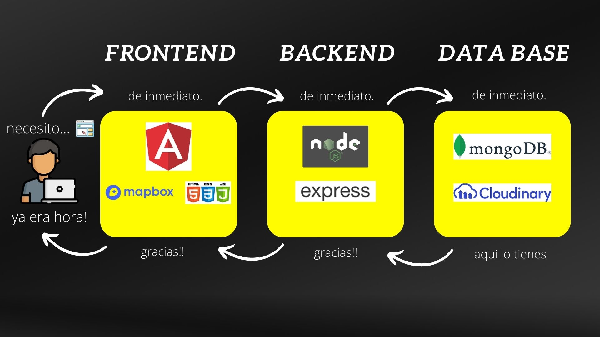
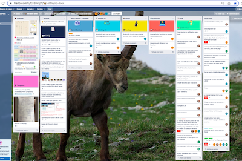
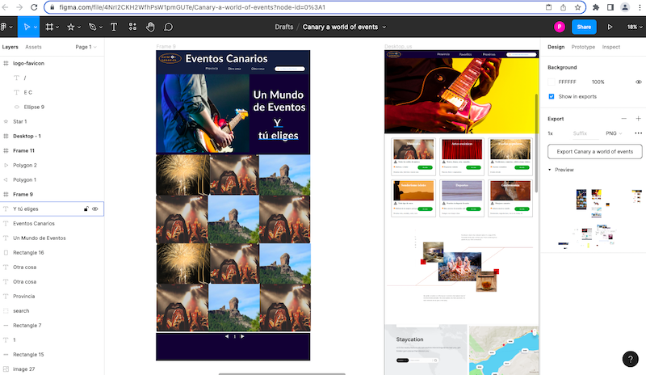
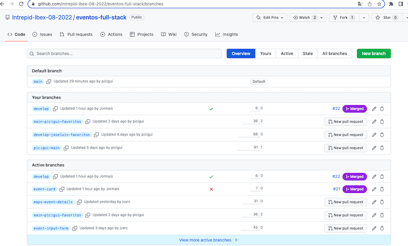
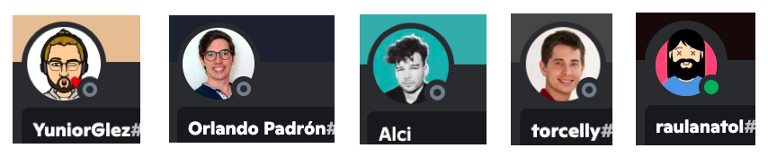

# Proyecto para final del curso FullStack de la SPEGC. ---> 

# EventosFullStack:

Es el nombre del proyecto y surgió de una de las propuestas mas votadas en el grupo de las CABRAS INTREPIDAS formados por los 5 integrantes iniciales.

La idea inicial era "la creación de una pagina que publicara todos los eventos proximos a realizar en Gran Canaria", es por eso que adoptamos el nombre de EVENTOS CANARIOS, con este proyecto queremos lograr que todo el que busque algo que hacer, fuera de casa, podrá abrir la pagina y ver las propuestas a elegir.

## Inicios

Una vez iniciado el proyectos decidimos que era necesario permitir que los usuarios registrados pudieran introducir los eventos una vez verificados por los gestores de la web.

Y aun nos quedan un par de ideas para ir incrementando la base de datos y eventos disponible, así como utilidades a añadir a los usuarios.

## Tecnologías

El appWeb esta basada en Angular en la parte del Frontend, Node JS en el Backend y las bases de datos utilizadas fueron MongoDB y Cloudinary

## Bocetos de inicio del proyeco

Esta era la idea inicial.

## Actualmente este es el aspecto del proyeco

## Responsive y Moviles:

Este apartado se ha consiguido en gran parte a un 90%, aunque todavia se encuentra en fase de prueba y seguro que se puede mejorar

## Dificultades:

La mayor dificultad del programa fué el ir incrementando los procesos de coneccion a la Api a medida que ibamos aprendiendo en el curso, pero nos ha servido de gran aprendizaje, así como el trabajar en equipo, ya que para alguno era una experiencia nueva.

Pero sin embargo puedo decir que !!!!! Reto superado !!!!!

## Herramientas:

Gracias a los profesores hemos aprendido a utilizar herramientas de trabajo como el Trello, el Figma y el github, así como a preparar nuestros Sprint Goal con las Daily Price y las Retrospectivas.

## Acceso al proyecto:

https://github.com/Intrepid-Ibex-08-2022/eventos-full-stack

https://eventos-canarios-09-2022.netlify.app/

This project was generated with [Angular CLI](https://github.com/angular/angular-cli) version 14.0.4.

## Acceso al equipo de desarrollo:

Con sus respectivos link de contacto:

# José Luis González Sánchez

https://github.com/picigui

https://www.linkedin.com/in/pici-gui-78b57293

# Juan Carlos Vargas Chávez

https://github.com/jvarc

https://www.linkedin.com/in/juan-carlos-vargas-chavez-407705128/

# Jonay Brito Hernández

https://github.com/Jormais

https://www.linkedin.com/in/jonaybrito

## Equipo de profesores del curso de FullStack

Nuestro agradecimiento al equipo de profesores del curso de FullStack, que nos han aportado una gran cantidad de conocimiento en tan poco tiempo,

# !!!! GRACIAS MIL ¡¡¡¡¡

